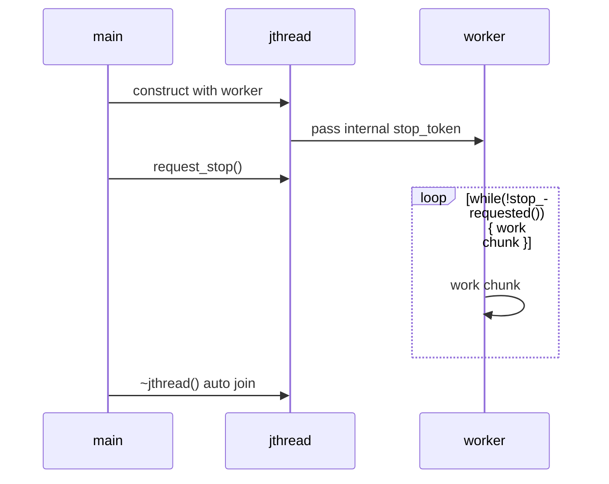
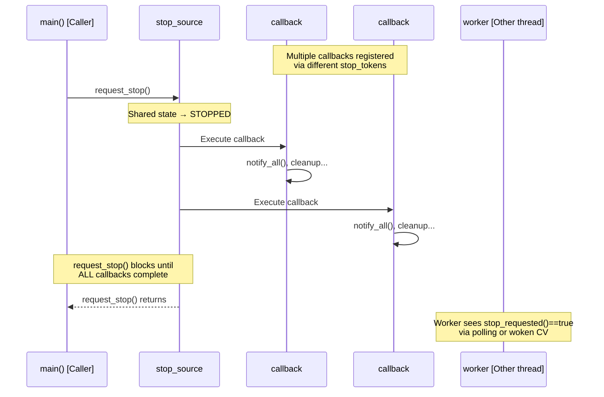

2025-12-13 15:05

Tags: [[programming]], [[study]]

# C++20 Cooperative Cancellation - jthread, stop_token, stop_callback Deep Dive

_Interview-ready mental model and code patterns for C++20's cancellation primitives_

This post distills the key insights from our discussion into crisp, interview-usable concepts, code patterns, and mental models. No fluff—just the patterns that distinguish "good" from "great" C++ concurrency answers. [modernescpp+3](https://www.modernescpp.com/index.php/cooperative-interruption-of-a-thread-in-c20/)​

## 1. jthread: "Thread with built-in cancellation source + auto-join"

**Core distinction from `std::thread`**:

```cpp

std::jthread t(worker);		// auto request_stop() + join() in destructor
				// worker(std::stop_token) auto transfer
t.request_stop();		// internal call for stop_source in jthread
```


**Mental model**: "`std::jthread` is `std::thread` + hidden `stop_source` + RAII join." Workers receive `stop_token` automatically as the last function parameter. [nextptr+1](https://www.nextptr.com/tutorial/ta1588653702/stdjthread-and-cooperative-cancellation-with-stop-token)​

**Sequence insight**:



## 2. stop_source ↔ stop_token: "Shared state + observer handle"


```cpp

std::stop_source src;      // owns shared stop state
std::stop_token tok1 = src.get_token();  // lightweight handle #1
std::stop_token tok2 = tok1;             // copy: reference count +1
```

**Key insight**: `stop_token` is a **cheap handle** (shared_ptr-like). Copying tokens copies handles, not state. All tokens see `stop_requested() == true` simultaneously after `src.request_stop()`. Values > references for API clarity. [simontoth.substack+1](https://simontoth.substack.com/p/daily-bite-of-c-stdstop_source-stdstop_token-3f6)​

**Interview one-liner**: "`stop_source` owns the shared stop state; `stop_token` copies are cheap handles observing that state."

## 3. Cooperative cancellation: "Signal, don't interrupt"

**Philosophy**: No OS-level thread interrupts. Workers decide _when/how_ to exit by:

- Polling `stop_token.stop_requested()` at work chunk boundaries
- Registering `stop_callback` for immediate reaction
    
```cpp

void worker(std::stop_token st) {
	while (!st.stop_requested()) {  // chunked work + check
		do_work_chunk();
	}
	cleanup();  // cooperative exit
}
```

**vs `atomic<bool>` flag**: `stop_token` adds `stop_callback` integration + API intent signaling + `jthread` synergy. [abhinavsingh+1](https://abhinavsingh.dev/blog/mastering-cpp-cooperative-cancellation)​

## 4. stop_callback: "RAII callback on stop request"

```cpp

void blocking_worker(std::stop_token st) {
	std::stop_callback cb(st, [&] {  // [&] = reference capture all
	cv.notify_all();              // wake blocking waits
	});

	cv.wait(/* until notified or stop */);
}
```

**Why RAII helper**:

- **Ctor**: Registers callback with token's shared state
- **Dtor**: Auto-unregisters (no leaks)
- **Execution**: Runs in `request_stop()` caller's thread (sync, potential latency) [modernescpp+1](https://www.modernescpp.com/index.php/cooperative-interruption-of-a-thread-in-c20-callbacks/)​

## stop_callback Execution Thread Sequence Diagram



**Performance note**: `request_stop()` blocks until _all_ callbacks complete **sequentially in the caller's thread**. Keep them tiny (notify, not heavy work). Multiple callbacks = sequential execution = potential latency.

## 5. CV + stop_token: "Interruptible blocking wait"

```cpp

std::mutex m;
std::condition_variable_any cv;
std::queue<int> work_queue;

void worker(std::stop_token st) {
	std::stop_callback cb(st, [&] { cv.notify_all(); });
	
	for (;;) {
		std::unique_lock lk(m);
		cv.wait(lk, [&] { return !work_queue.empty() || st.stop_requested(); });
		
		if (st.stop_requested() && work_queue.empty()) break;
		// process work...
	}
}
```

**Pattern**: `stop_callback` wakes CV → predicate checks `stop_requested()` → clean exit. [modernescpp+1](https://www.modernescpp.com/index.php/cooperative-interruption-of-a-thread-in-c20/)​

## 6. Multi-phase cancellation: "Multiple stop_sources"

```cpp

std::stop_source io_source, cpu_source;

void phased_worker(std::stop_token io_tok, std::stop_token cpu_tok) {
	while (!io_tok.stop_requested())   { io_work(); }
	while (!cpu_tok.stop_requested())  { cpu_work(); }
}

// Cancel IO phase only:
io_source.request_stop();
```

**Insight**: Multiple `stop_source`s, each controlling independent cancellation domains. [simontoth.substack+1](https://simontoth.substack.com/p/daily-bite-of-c-stdstop_source-stdstop_token-3f6)​

## 7. Server shutdown pattern

```cpp

struct Client { int sock; };
std::vector<std::jthread> clients;

void client_worker(std::stop_token st, Client c) {
	while (!st.stop_requested()) {
		// recv/process
	}
	close(c.sock);  // cleanup in worker
}

void shutdown() {
	for (auto& t : clients) t.request_stop();
	// ~jthread auto-joins, workers cleanup sockets
}
```

**Flow**: `request_stop()` → workers detect + cleanup → auto-join. [nextptr+1](https://www.nextptr.com/tutorial/ta1588653702/stdjthread-and-cooperative-cancellation-with-stop-token)​

## Interview Cheat Sheet

| Question                 | 1-sentence Answer                                                 | Keywords                                  |
| ------------------------ | ----------------------------------------------------------------- | ----------------------------------------- |
| jthread vs thread        | "Built-in stop_source + auto-join via destructor"                 | `request_stop()`, auto `stop_token` param |
| Token copy semantics     | "Cheap handle, shared_ptr-like reference counting"                | copy=handle copy, shared state unchanged  |
| Cooperative vs interrupt | "Signal only; worker controls exit timing"                        | polling, `stop_callback`, no forced exit  |
| stop_callback thread     | "**Runs in `request_stop()` caller's thread** (sync, sequential)" | blocks caller, keep fast, deadlock risk   |
| CV integration           | "`stop_callback` → notify → predicate sees `stop_requested()`"    | interruptible wait, RAII callback         |

## Key Takeaways

1. **`jthread`**: Use everywhere `std::thread` was used (modern C++20 default)
2. **`stop_token`**: Pass by value. Signals cancellation _intent_ in APIs
3. **`stop_callback`**: Perfect for "wake blocking operations on cancel"
4. **Chunked work**: Always structure work as `while(!stop_requested()) { chunk }`
5. **Multi-domain**: Multiple `stop_source`s for phased/independent cancellation
    
This mental model—**"signal → observe → cooperate"**—scales from single workers to complex server shutdowns. The sequence diagram above makes the critical "`request_stop()` blocks caller thread `insight crystal clear for interviews. Next level: integrate with coroutines` ( `co_await` on stoppable operations). [modernescpp+3](https://www.modernescpp.com/index.php/cooperative-interruption-of-a-thread-in-c20-callbacks/)​

## Reference sources

1. [https://www.modernescpp.com/index.php/cooperative-interruption-of-a-thread-in-c20-callbacks/](https://www.modernescpp.com/index.php/cooperative-interruption-of-a-thread-in-c20-callbacks/)
2. [https://tcs.rwth-aachen.de/docs/cpp/reference/en.cppreference.com/w/cpp/thread/stop_callback.html](https://tcs.rwth-aachen.de/docs/cpp/reference/en.cppreference.com/w/cpp/thread/stop_callback.html)
3. [https://www.modernescpp.com/index.php/cooperative-interruption-of-a-thread-in-c20/](https://www.modernescpp.com/index.php/cooperative-interruption-of-a-thread-in-c20/)
4. [https://www.nextptr.com/tutorial/ta1588653702/stdjthread-and-cooperative-cancellation-with-stop-token](https://www.nextptr.com/tutorial/ta1588653702/stdjthread-and-cooperative-cancellation-with-stop-token)
5. [https://simontoth.substack.com/p/daily-bite-of-c-stdstop_source-stdstop_token-3f6](https://simontoth.substack.com/p/daily-bite-of-c-stdstop_source-stdstop_token-3f6)
6. [https://bolu.dev/programming/2024/03/01/jthreads.html](https://bolu.dev/programming/2024/03/01/jthreads.html)
7. [https://tcs.rwth-aachen.de/docs/cpp/reference/en.cppreference.com/w/cpp/thread/stop_token.html](https://tcs.rwth-aachen.de/docs/cpp/reference/en.cppreference.com/w/cpp/thread/stop_token.html)
8. [https://abhinavsingh.dev/blog/mastering-cpp-cooperative-cancellation](https://abhinavsingh.dev/blog/mastering-cpp-cooperative-cancellation)